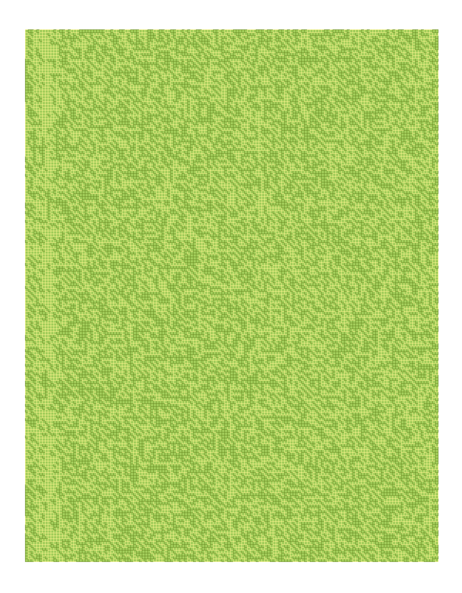

This repository provides additional resources for blog posts in my [blog](https://thegreatwhiteshark.tech.blog/).

# [art](art)
## [Moses receiving the Ten Commandments on top of mount Sinai](art/moses)
Contains the [Gimp](https://www.gimp.org/) [project](art/moses/moses.xcf) of the corresponding piece.

The default startup screen of Emacs in a pop art-like compilation using the [Zenburn](http://kippura.org/zenburnpage/) color scheme. My personal take on the [church of Emacs](https://www.emacswiki.org/emacs/ChurchOfEmacs). For further information see the corresponding blog post.

## [The digital revolution](art/the-digital-revolution)
What is art and how it is perceived? 

In this piece I take the iconic photograph of Che Guevara and display the binary representation as a heatmap. Noise or art? Well, who knows...

Contains the [R code](art/the-digital-revolution/the-digital-revolution.R), the [source image](art/the-digital-revolution/113px-CheHigh.jpg), and the [resulting image](art/the-digital-revolution/the-digital-revolution.png).
